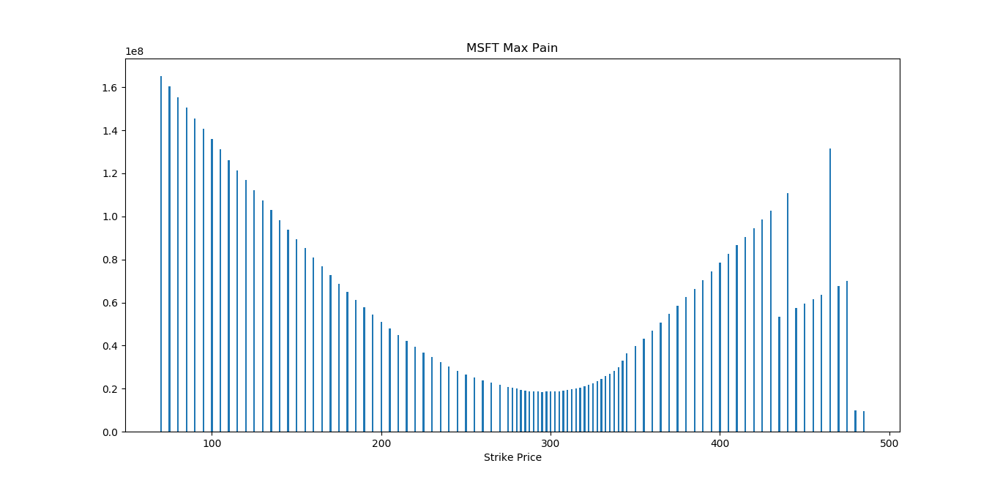

# Options-Max-Pain-Calculator
A python command line tool to calculate options max pain for a given company symbol and options expiry date.


### Overview - Max Pain Theory
The Maximum Pain theory states that an option's price will gravitate towards a max pain price, in some cases equal to the strike price for an option, that causes the maximum number of options to expire worthless.

### Calculating the Max Pain Point
For each in-the-money strike price for both puts and calls:

1. Find the difference between stock price and strike price
2. Multiply the result by open interest at that strike
3. Add together the dollar value for the put and call at that strike
4. Repeat for each strike price
5. Find the highest value strike price. This price is equivalent to max pain price.

Source: [Investopedia](https://www.investopedia.com/terms/m/maxpain.asp)


### How to run:
```
pip install -r requirements.txt
python3 OptionsMaxPainCalc.py
```

### Sample Output:
```
Enter the Symbol: msft
Expiry dates:
2022-01-14, 2022-01-21, 2022-01-28, 2022-02-04, 2022-02-11, 2022-02-18, 2022-02-25, 2022-03-18, 2022-04-14, 2022-05-20, 2022-06-17, 2022-07-15, 2022-09-16, 2023-01-20, 2023-03-17, 2023-06-16, 2024-01-19, 
Enter the Expiry data [format: YYYY-MM-DD]: 2022-01-21
Maximum Pain: 291.0 < 300.0 < 309.0
Put to call ratio: 0.48
```



### Using Max Pain
Traders use max pain level to identity the strikes which they can write. In the sample run above: 300 is the expected expiry level, one can choose to write call options above 300 or put options below 300 and collect all the premiums.
